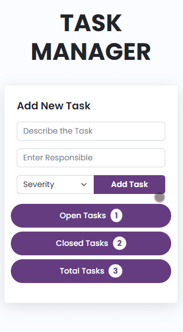
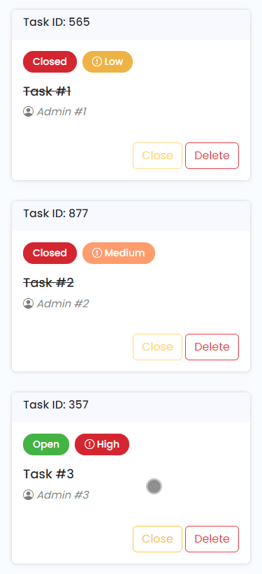

# Task Manager

## Table of contents

- [Overview](#overview)
  - [Screenshot](#screenshot)
  - [Links](#links)
- [Built with](#built-with)
- [Useful resources](#useful-resources)
- [Author](#author)

## Overview

This is a task management web app in which I utilized HTML, CSS, and Javascript. You may create any task in this app and assign it to people who are in charge of it. You may also choose the level of difficulty for particular assignment.

### Screenshot

Desktop View

Mobile View

    <table>
     <tr>
         <td style="border:none">
             
           </td>
            <td style="border:none">
             
            </td>
        </tr>
    </table>

### Links

- Code URL: [https://github.com/Mozahidul01/Task-Manager]

- Live Site URL: [https://task-manager-mozo.pages.dev/]

### Built with

- HTML5
- CSS3
- Bootstrap 5
- JavaScript

### Useful resources

- [Filter method by flexiple](https://flexiple.com/javascript/javascript-filter-array/) - This article helps me to understand javascript filters array method more clearly.
- [Bootstrap](https://getbootstrap.com/docs/5.2/getting-started/introduction/) - I have used bootstrap as css framework.

## Author

- [Website](https://www.mozahidul.com)
- [Github](https://github.com/mozahidul01)
- [LinkedIn](https://www.linkedin.com/in/mozahidul01/)
- [Facebook](https://facebook.com/mozahidul01)
